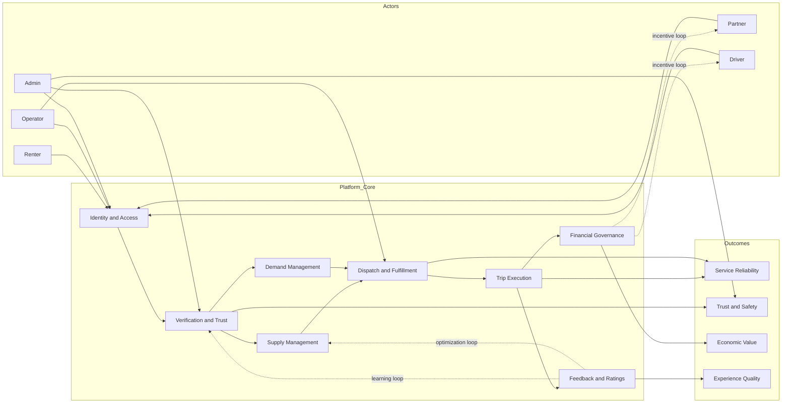

# MOBILIS Conceptual Framework

## 1) Framework Type

This system is best described as a **multi-sided socio-technical service platform** rather than a simple input-process-output pipeline.

It connects multiple actors (renter, partner, driver, operator, admin) through shared digital capabilities (identity, marketplace, dispatch, trust, and payouts) under governance rules.

---

## 2) Core System Purpose

To coordinate safe, verified, and efficient mobility transactions by matching demand (renters) with supply (vehicles and driving service), while enforcing trust, compliance, and operational control.

---

## 3) Conceptual Domains

### A. Actor Domain (Who)
- **Renter**: requests vehicle-only or vehicle-with-driver service.
- **Partner (vehicle owner)**: supplies vehicles and receives earnings.
- **Driver**: supplies driving labor for assigned trips.
- **Operator**: performs booking approvals, visibility control, and driver assignment.
- **Admin**: governs verification, compliance, and policy enforcement.

### B. Platform Capability Domain (What Enables)
- **Identity and Access**: role-based authentication and role routing.
- **Verification and Trust**: ID checks, license/NBI checks, status gating.
- **Supply Management**: vehicle application, approval, and availability toggles.
- **Demand Management**: booking creation, booking states, user notifications.
- **Dispatch and Fulfillment**: driver offer, acceptance/decline, trip lifecycle.
- **Financial Governance**: earnings split, commission, payout tracking.
- **Communication Layer**: notifications, messaging, and status visibility.

### C. Governance and Control Domain (Rules)
- **Eligibility rules**: only approved users/vehicles/drivers can participate.
- **Workflow rules**: booking and dispatch state transitions are controlled.
- **Safety/compliance rules**: document validity and approval checkpoints.
- **Operational rules**: operator overrides, cancellation, reassignment.

### D. Outcome Domain (Why It Matters)
- **Service reliability**: successful matching and trip completion.
- **Trust and safety**: verified identities, approved assets, controlled access.
- **Economic value**: earnings for partners/drivers and commission for platform.
- **Experience quality**: ratings, feedback, repeat usage.

---

## 4) End-to-End Conceptual Logic

1. **Onboarding and Identity Formation**
   - Users register and declare role.
   - Verification status creates different participation permissions.

2. **Supply Activation**
   - Partners submit vehicles and documents.
   - Admin approves; operator controls marketplace visibility.
   - Drivers submit credentials and become available after approval.

3. **Demand Capture and Service Selection**
   - Renter creates booking request.
   - Request includes service mode: self-drive or with-driver.

4. **Operational Decision and Dispatch**
   - Operator approves/rejects booking.
   - With-driver requests trigger driver assignment and offer response.

5. **Service Execution**
   - Trip moves from approved to active to completed.
   - Status and notifications synchronize all actors.

6. **Value Realization and Learning**
   - Ratings and payout records are generated.
   - Performance data feeds future decisions (availability, approvals, tiering).

---

## 5) Conceptual Relationship Model

---

## 6) Key Constructs and Indicators

Use these as measurable constructs for system evaluation:

1. **Access and Activation**
   - Account completion rate
   - Verification approval rate
   - Time-to-activation per role

2. **Marketplace Health**
   - Active vehicles ratio
   - Driver availability ratio
   - Booking request fulfillment rate

3. **Operational Performance**
   - Booking approval lead time
   - Driver assignment success rate
   - Trip completion rate

4. **Trust and Safety**
   - Document expiry violation incidence
   - Rejection reasons distribution
   - Incident/cancellation due to compliance

5. **Economic Performance**
   - Gross booking value
   - Net partner earnings
   - Net driver earnings
   - Platform commission realization

6. **Experience and Retention**
   - Average rating (driver/vehicle)
   - Repeat booking rate
   - Complaint-to-booking ratio

---

## 7) Research/Design Propositions (Optional)

- Higher verification quality increases trust and booking conversion.
- Better operator decision speed increases fulfillment and satisfaction.
- Driver availability alignment with demand hotspots increases completion rate.
- Transparent payout and rating systems improve partner/driver retention.

---

## 8) Practical Use of This Framework

You can use this model to:
- design system modules and responsibilities,
- structure KPI dashboards,
- guide policy and workflow improvements,
- support thesis/capstone conceptual discussions,
- map feature requests to strategic outcomes.
